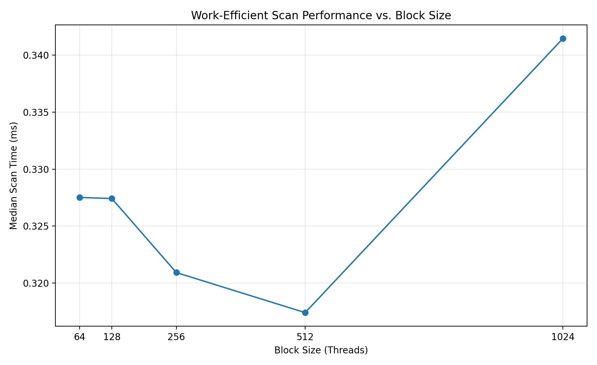
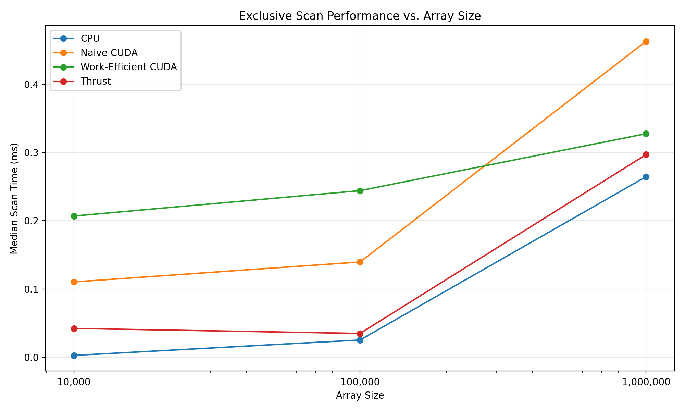
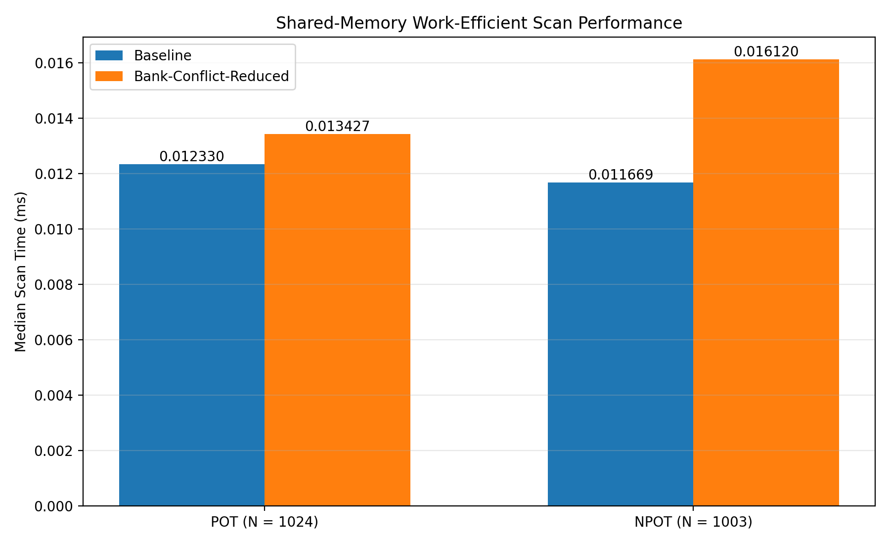

CUDA Stream Compaction
======================

**University of Pennsylvania, CIS 565: GPU Programming and Architecture, Project 2**

* Ethan Yang
  * [GitHub](https://github.com/eyang72004)
* Tested on: Windows 11 (Personal Laptop), Intel(R) Core(TM) Ultra 9 275HX, 32 GB RAM, NVIDIA GeForce RTX 5060 Laptop GPU


## Implementation


This project implements several versions of exclusive prefix-sum scan and stream compaction on the CPU and GPU. I implemented a serial CPU scan, a naive CUDA scan, a work-efficient CUDA scan, stream compaction, and a Thrust scan for comparison. For extra credit, I also implemented radix sort using my work-efficient scan and shared-memory versions of the naive and work-efficient scans, including a version designed to reduce shared-memory bank conflicts.


### CPU

I implemented the CPU scan as a serial exclusive prefix sum. I also implemented two CPU versions of stream compaction: one that directly copies nonzero elements into the output array, and one that maps the input to booleans, performs an exclusive scan, and scatters the nonzero elements to their new indices.


### Naive GPU Scan

I implemented the naive CUDA scan using the iterative scan approach from the course material. Each iteration uses an offset that doubles from the previous iteration, and I use two device buffers that swap after each kernel launch so that threads do not read values that are being updated during the same iteration. The resulting inclusive scan is then shifted by one element to produce the required exclusive scan.


### Work-Efficient GPU Scan

I implemented the work-efficient scan using the up-sweep and down-sweep approach from the course material and GPU Gems Chapter 39. Since this algorithm operates on a power-of-two-sized tree, I round the working array size up to the next power of two and pad the remaining entries with zeros. I also reduce the number of threads and blocks launched at deeper levels of the tree as the amount of active work decreases.


### GPU Stream Compaction

I implemented GPU stream compaction by first mapping each input element to 1 if it is nonzero and 0 otherwise. I then use my work-efficient exclusive scan to compute the destination indices and scatter the nonzero input elements into the output array.


### Thrust Scan

For comparison, I implemented an exclusive scan using `thrust::exclusive_scan`. I copy the input into a `thrust::device_vector`, perform the scan on the GPU, and copy the result back to the host. For performance measurements, I time only the `thrust::exclusive_scan` call so that the initial and final memory operations are excluded from the measured scan time.


### Extra Credit: Radix Sort

I implemented a GPU radix sort for nonnegative integers using my work-efficient scan. For each bit from least significant to most significant, I map each element based on the current bit and perform an exclusive scan over the elements whose bit is 0. I use the scan results to place the 0-bit elements first and the 1-bit elements after them, then scatter the input into the resulting positions. I repeat this process for all 32 bits while swapping between two device buffers after each pass.


### Extra Credit: Shared-Memory Scan

I also implemented shared-memory versions of the naive and work-efficient scans based on GPU Gems Chapter 39. The work-efficient version performs the up-sweep and down-sweep within a single CUDA block using dynamically allocated shared memory. I also implemented a bank-conflict-reduced version that changes the shared-memory indexing and inserts padding based on a 32-bank shared-memory layout.

I subsequently extended the work-efficient shared-memory implementations to support non-power-of-two input sizes. Because the underlying Blelloch tree operates on a power-of-two number of elements, the host wrapper rounds the logical input size up to the next power of two, zero-initializes the padded device input, copies the original `n` elements into it, and launches the shared-memory scan over the padded size. Only the first `n` results are copied back to the host. Zero padding preserves the exclusive-prefix results for the original elements. This shared-memory implementation is a single-block scan, so the tested problem sizes are limited by the number of threads and shared memory available to one block.

For the bank-conflict-reduced version, I allocate additional shared memory for the padded indexing scheme and use the conflict-free offset when accessing the shared array. I used Nsight Compute to compare the shared-memory bank conflicts of the baseline and padded work-efficient kernels, and I also benchmarked the two implementations on both power-of-two and non-power-of-two inputs.


## Performance Analysis

I performed all performance testing using a true Release build on the system listed above. For the scan benchmarks, I excluded initial and final memory allocation and transfer operations from the measured GPU execution time. Each benchmark used 10 discarded warm-up runs followed by 20 measured trials. A preliminary warm-up diagnostic showed no systematic warm-up trend: the naive scan remained approximately 0.46 ms across warm-ups 1–10 at an input size of 1,000,000, while the work-efficient implementation showed ordinary run-to-run variation without a persistent downward trend. I therefore excluded the warm-up runs from the reported measurements and averaged the subsequent 20 trials. For the final experiments, I repeated each program configuration five times and report the median of the five 20-trial averages to reduce the effect of run-to-run timing variation.


### Block Size Optimization

Before collecting the final scaling results, I regenerated the block-size sweep for the optimized work-efficient CUDA scan at an input size of 1,000,000 elements using the final benchmark methodology. I varied only the block size used by the optimized work-efficient scan while leaving the other implementations unchanged. For each block size, I discarded 10 warm-up runs, averaged 20 measured trials, repeated the program five times, and compared the median of the five resulting averages.

| Block Size | Work-Efficient Scan (ms) |
|-----------:|-------------------------:|
| 64         | 0.327514                 |
| 128        | 0.327418                 |
| 256        | 0.320920                 |
| 512        | **0.317402**             |
| 1024       | 0.341470                 |



A block size of 512 produced the lowest median execution time, so I used 512 threads per block for the optimized work-efficient scan in the final scaling benchmarks. The differences among 64, 128, 256, and 512 threads were relatively small, but 512 was the measured winner under the final repeated-trial protocol. The 1024-thread configuration was slower, with a median of 0.341470 ms compared with 0.317402 ms for 512 threads.


### Scan Performance

I compared the serial CPU, naive CUDA, optimized work-efficient CUDA, and Thrust scans at array sizes of 10,000, 100,000, and 1,000,000 elements. At each array size, I discarded 10 warm-up runs and averaged the following 20 measured trials. I repeated the program five times and report the median of the five 20-trial averages below.

| Array Size | Serial CPU (ms) | Naive CUDA (ms) | Work-Efficient CUDA (ms) | Thrust (ms) |
|-----------:|----------------:|----------------:|-------------------------:|------------:|
| 10,000     | 0.002605        | 0.110285        | 0.206894                 | 0.042138    |
| 100,000    | 0.025165        | 0.139509        | 0.244072                 | 0.034758    |
| 1,000,000  | 0.264510        | 0.462981        | 0.327491                 | 0.296862    |



At 10,000 and 100,000 elements, the serial CPU scan was faster than the GPU implementations. At these smaller sizes, the available parallel work is limited relative to GPU kernel-launch and synchronization overhead. The work-efficient CUDA scan was also slower than the naive CUDA scan at these two sizes. Although the work-efficient algorithm performs asymptotically less work, it still requires separate up-sweep and down-sweep kernel launches at each tree level, and non-power-of-two inputs are padded to the next power of two.

At 1,000,000 elements, the reduced work of the work-efficient algorithm became more beneficial. The work-efficient CUDA scan took 0.327491 ms, compared with 0.462981 ms for the naive CUDA scan, so the work-efficient implementation was approximately 29.3% faster than the naive implementation at this size. The serial CPU scan measured 0.264510 ms and Thrust measured 0.296862 ms, so the CPU scan was the fastest of the four implementations in this particular benchmark. These results also show that lower algorithmic work does not by itself guarantee the lowest wall-clock time: kernel-launch structure, synchronization, memory access behavior, and implementation overhead remain important, especially at smaller problem sizes.


### Thrust Profiling


The Nsight Systems timeline shows that the `thrust::exclusive_scan` call is surrounded by other Thrust operations, including copy and initialization work. For the performance comparison above, I timed only the `thrust::exclusive_scan` call so that the surrounding memory operations were excluded from the scan timing. The timeline also shows that the scan itself is only one part of the overall Thrust wrapper activity.


### Extra Credit: Work-Efficient Scan Optimization

For the work-efficient scan, I reduced the amount of inactive work at deeper levels of the up-sweep and down-sweep. In the straightforward implementation, the full padded grid is launched at every tree level even though progressively fewer elements participate as the scan approaches the root. In the optimized implementation, I calculate the active work at each level and launch only the number of threads and blocks required for that level.

To measure this optimization in isolation, I retained an unoptimized version of the same work-efficient scan that launches the full padded grid at every level and compared it against the optimized implementation at an input size of 1,000,000 elements. Both implementations used the same scan algorithm and benchmark methodology; the intended experimental difference was the amount of work launched at each tree level. Each program execution used 10 discarded warm-up runs followed by 20 measured trials, and I repeated the program five times and compared the medians of the five averages.

| Implementation | Median Time (ms) |
|:---------------|-----------------:|
| Full-grid work-efficient scan | 0.442200 |
| Active-grid work-efficient scan | **0.340526** |

Launching only the active work reduced the median scan time from 0.442200 ms to 0.340526 ms. This corresponds to approximately a **23.0% reduction in execution time**, or a **1.30x speedup**, demonstrating that avoiding unnecessary thread and block launches at the deeper tree levels had a substantial effect on this implementation.


### Extra Credit: Radix Sort


I implemented radix sort using my work-efficient scan as the scan operation for each bitwise split. The sort can be called with an output array, an input array, and the number of elements:

```cpp
StreamCompaction::Radix::sort(n, output, input);
```


For example, an input such as `[7, 2, 5, 2, 1]` produces the sorted output `[1, 2, 2, 5, 7]`.


### Extra Credit: Shared-Memory Scan

I evaluated the bank-conflict-reduced work-efficient shared-memory scan in two ways: hardware profiling with Nsight Compute and repeated wall-clock kernel timing. Nsight Compute showed that the padded indexing scheme eliminated the measured shared-memory bank conflicts in the profiled test: the baseline work-efficient kernel reported 245 bank conflicts, while the bank-conflict-reduced kernel reported 0.


I also compared the baseline and bank-conflict-reduced work-efficient shared-memory scans using the final benchmark methodology on both a power-of-two input (`N = 1024`) and a non-power-of-two input (`N = 1003`). For each configuration, I discarded 10 warm-up runs, averaged 20 measured trials, repeated the program five times, and report the median of the five averages.

| Input Size | Input Type | Baseline Shared (ms) | Bank-Conflict-Reduced (ms) | Timing Change |
|-----------:|:-----------|---------------------:|----------------------------:|--------------:|
| 1024       | Power of two | **0.012330** | 0.013427 | 8.9% slower |
| 1003       | Non-power of two | **0.011669** | 0.016120 | 38.1% slower |



Although the padded indexing scheme eliminated the bank conflicts observed by Nsight Compute, it did not improve wall-clock execution time in these benchmarks. At `N = 1024`, the bank-conflict-reduced implementation was approximately 8.9% slower than the baseline, and at `N = 1003`, it was approximately 38.1% slower. These kernels execute a very small, single-block workload, with absolute execution times on the order of hundredths of a millisecond. At this scale, the benefit of eliminating bank conflicts was not large enough to outweigh other costs of the padded implementation, such as additional shared-memory indexing and padding overhead.

The non-power-of-two case also pads `N = 1003` to a 1024-element working tree, so it uses the same 512-thread launch size and essentially the same shared-memory scan structure as the `N = 1024` case. Therefore, the NPOT result should not be interpreted as a large-scale shared-memory scan benchmark; rather, it verifies that the single-block implementation handles NPOT inputs correctly while also showing that the bank-conflict optimization did not produce a timing benefit for this small workload on the tested GPU. The profiler and timing results together illustrate that improving a specific hardware metric does not necessarily translate directly into lower end-to-end kernel execution time.


## Testing

I tested the CPU, naive CUDA, work-efficient CUDA, and Thrust scan implementations on both power-of-two and non-power-of-two input sizes. I also tested the shared-memory naive, shared-memory work-efficient, and bank-conflict-reduced shared-memory work-efficient scans on both power-of-two and non-power-of-two inputs. The stream-compaction implementations were tested on power-of-two and non-power-of-two inputs, and the radix-sort tests cover power-of-two, non-power-of-two, and duplicate-value cases. The final true Release build passed all of these correctness tests.

```text
****************
** SCAN TESTS **
****************
==== cpu scan, power-of-two ====
==== cpu scan, non-power-of-two ====
    passed
==== naive scan, power-of-two ====
    passed
==== naive scan, non-power-of-two ====
    passed
==== shared naive scan, power-of-two ====
    passed
==== shared naive scan, non-power-of-two ====
    passed
==== shared work-efficient scan, power-of-two ====
    passed
==== shared work-efficient scan, non-power-of-two ====
    passed
==== unoptimized work-efficient scan, power-of-two ====
    passed
==== unoptimized work-efficient scan, non-power-of-two ====
    passed
==== work-efficient scan, power-of-two ====
    passed
==== work-efficient scan, non-power-of-two ====
    passed
==== shared work-efficient bank-conflict-free scan, power-of-two ====
    passed
==== shared work-efficient bank-conflict-free scan, non-power-of-two ====
    passed
==== thrust scan, power-of-two ====
    passed
==== thrust scan, non-power-of-two ====
    passed

*****************************
** STREAM COMPACTION TESTS **
*****************************
==== cpu compact without scan, power-of-two ====
    passed
==== cpu compact without scan, non-power-of-two ====
    passed
==== cpu compact with scan ====
    passed
==== work-efficient compact, power-of-two ====
    passed
==== work-efficient compact, non-power-of-two ====
    passed

**********************
** RADIX SORT TESTS **
**********************
==== radix sort, power-of-two ====
    passed
==== radix sort, non-power-of-two ====
    passed
==== radix sort, duplicates ====
    passed
```

## Build Instructions

I built and tested the project on Windows 11 using CMake, Ninja, Visual Studio 2026 Community/MSVC, and CUDA 13.3. During development, I initially used the `x64-Release` build profile. However, I found that this configuration was using `RelWithDebInfo` and enabling CUDA device debugging (`-G`), which would distort GPU performance measurements. I therefore created a separate `true-Release` build directory explicitly configured with `-DCMAKE_BUILD_TYPE=Release`. All final performance measurements reported above were collected using this true Release configuration.

To configure the Release build from the project root:

```bat
cmake -S . -B out\build\true-Release -G Ninja -DCMAKE_BUILD_TYPE=Release
```

To build the project:

```bat
cmake --build out\build\true-Release
```

To run the test program:

```bat
out\build\true-Release\bin\cis5650_stream_compaction_test.exe
```